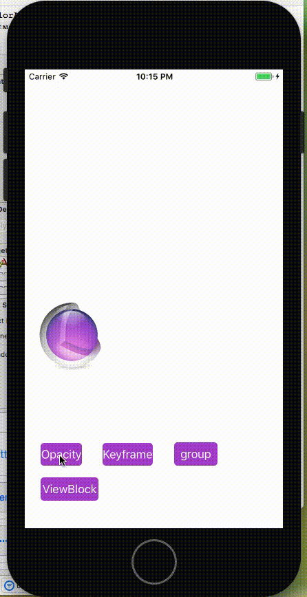

# CoreAnimationGuide
https://developer.apple.com/library/content/documentation/Cocoa/Conceptual/CoreAnimation_guide/CreatingBasicAnimations/CreatingBasicAnimations.html#//apple_ref/doc/uid/TP40004514-CH3-SW1


#Core Animation
##总结
该文章为对苹果文档内容的总结，原文[https://developer.apple.com/library/content/documentation/Cocoa/Conceptual/CoreAnimation_guide/Introduction/Introduction.html#//apple_ref/doc/uid/TP40004514-CH1-SW1](https://developer.apple.com/library/content/documentation/Cocoa/Conceptual/CoreAnimation_guide/Introduction/Introduction.html#//apple_ref/doc/uid/TP40004514-CH1-SW1)  


##Core Animation Manages Your App’s Content
Core Animation is not a drawing system itself. It is an infrastructure for compositing and manipulating your app’s content in hardware. At the heart of this infrastructure are layer objects, which you use to manage and manipulate your content. A layer captures your content into a bitmap that can be manipulated easily by the graphics hardware.  

###Core Animation Basics
Most of the animations you create using Core Animation involve the modification of the layer’s properties. Like views, layer objects have a bounds rectangle, a position onscreen, an opacity, a transform, and many other visually-oriented properties that can be modified. Include implicit animation and explicit animation.  

Figure 1-1  How Core Animation draws content  
  

Figure 1-2  Examples of animations you can perform on layers  
  

Figure 1-3  The default layer geometries for iOS and OS X. 
  

Figure 1-4  The default unit coordinate systems for iOS and OS X. 用于rotate旋转的时候，the anchor point以哪里为轴旋转，比如中心、左上角等.
.   

Figure 1-6  How the anchor point affects layer transformations  
  

<hr>**Layers Can Be Manipulated in Three Dimensions** <hr> 
Figure 1-7  Converting a coordinate using matrix math  
  

Figure 1-8  Matrix configurations for common transformations  
  

Figure 1-9  Layers associated with a window  
  

Figure 1-10  The layer trees for a window  
  


###Setting Up Layer Objects
Listing 2-1  Specifying the layer class of an iOS view  

```
+ (Class) layerClass {
   return [CAMetalLayer class];
}
```

Table 2-1  CALayer subclasses and their uses  
CAEmitterLayer、CAGradientLayer、CAMetalLayer、CAEAGLLayer/CAOpenGLLayer、CAReplicatorLayer、CAScrollLayer、CAShapeLayer、CATextLayer、CATiledLayer、CATransformLayer、QCCompositionLayer  

Figure 2-2  Scaling-based gravity constants for layers  
  

Figure 2-3  Adding a border and background to a layer  
  

Figure 2-4  A corner radius on a layer  
  

```
Because it involves applying a transparency mask, the corner radius does not affect the image 
in the layer’s contents property unless the masksToBounds property is set to YES.
```  

##Layer Modifications Trigger Animations


###Animating Layer Content
本章下面的四个例子效果图：  
  
github代码地址：  

Listing 3-1  Animating a change implicitly  

```
theLayer.opacity = 0.0;
```

Listing 3-2  Animating a change explicitly  

```
CABasicAnimation* fadeAnim = [CABasicAnimation animationWithKeyPath:@"opacity"];
fadeAnim.fromValue = [NSNumber numberWithFloat:1.0];
fadeAnim.toValue = [NSNumber numberWithFloat:0.0];
fadeAnim.duration = 1.0;
[theLayer addAnimation:fadeAnim forKey:@"opacity"];
 
// Change the actual data value in the layer to the final value.
theLayer.opacity = 0.0;
```

Listing 3-3  Creating a bounce keyframe animation

```
// create a CGPath that implements two arcs (a bounce)
CGMutablePathRef thePath = CGPathCreateMutable();
CGPathMoveToPoint(thePath,NULL,74.0,74.0);
CGPathAddCurveToPoint(thePath,NULL,74.0,500.0,
                                   320.0,500.0,
                                   320.0,74.0);
CGPathAddCurveToPoint(thePath,NULL,320.0,500.0,
                                   566.0,500.0,
                                   566.0,74.0);
 
CAKeyframeAnimation * theAnimation;
 
// Create the animation object, specifying the position property as the key path.
theAnimation=[CAKeyframeAnimation animationWithKeyPath:@"position"];
theAnimation.path=thePath;
theAnimation.duration=5.0;
 
// Add the animation to the layer.
[theLayer addAnimation:theAnimation forKey:@"position"];
```

Listing 3-4  Animating two animations together

```
// Animation 1
CAKeyframeAnimation* widthAnim = [CAKeyframeAnimation animationWithKeyPath:@"borderWidth"];
NSArray* widthValues = [NSArray arrayWithObjects:@1.0, @10.0, @5.0, @30.0, @0.5, @15.0, @2.0, @50.0, @0.0, nil];
widthAnim.values = widthValues;
widthAnim.calculationMode = kCAAnimationPaced;
 
// Animation 2
CAKeyframeAnimation* colorAnim = [CAKeyframeAnimation animationWithKeyPath:@"borderColor"];
NSArray* colorValues = [NSArray arrayWithObjects:(id)[UIColor greenColor].CGColor,
            (id)[UIColor redColor].CGColor, (id)[UIColor blueColor].CGColor,  nil];
colorAnim.values = colorValues;
colorAnim.calculationMode = kCAAnimationPaced;
 
// Animation group
CAAnimationGroup* group = [CAAnimationGroup animation];
group.animations = [NSArray arrayWithObjects:colorAnim, widthAnim, nil];
group.duration = 5.0;
 
[myLayer addAnimation:group forKey:@"BorderChanges"];
```

###Advanced Animation Tricks

###Layer Style Property Animations

###Animatable Properties


##Layers Can Be Organized into Hierarchies
Layers can be arranged hierarchically to create parent-child relationships like views.

###Building a Layer Hierarchy


##Actions Let You Change a Layer’s Default Behavior
Core Animation uses action objects to implement the default set of animations normally associated with layers.

###Changing a Layer’s Default Behavior


